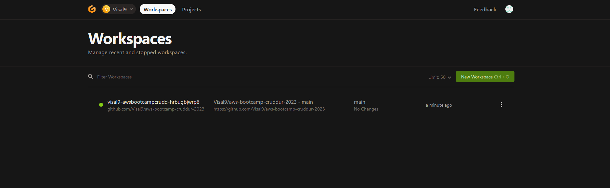
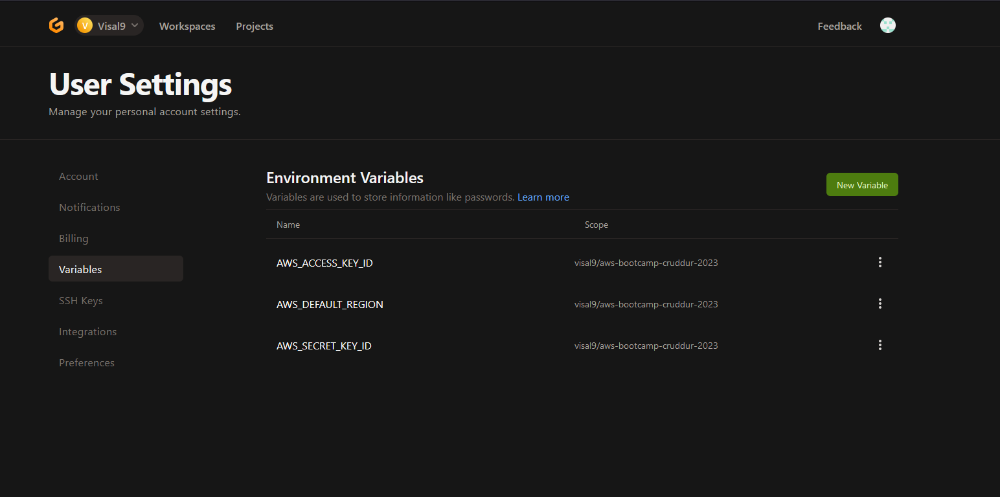
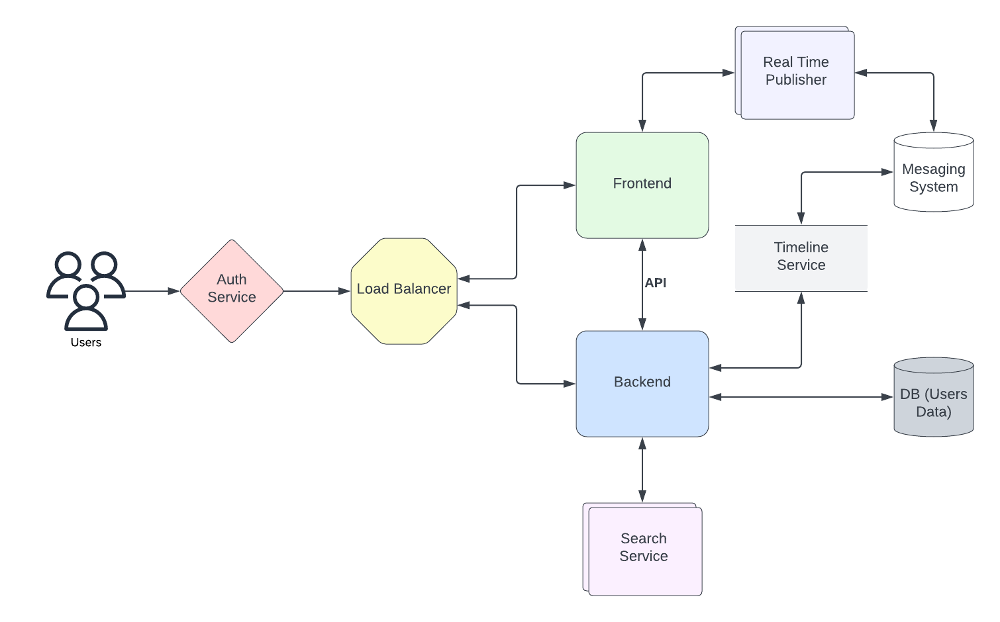
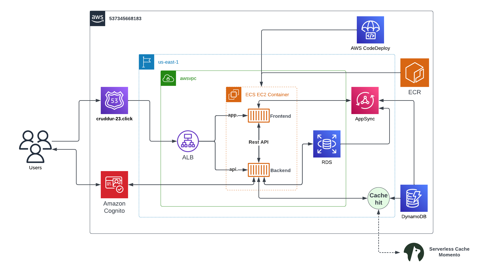
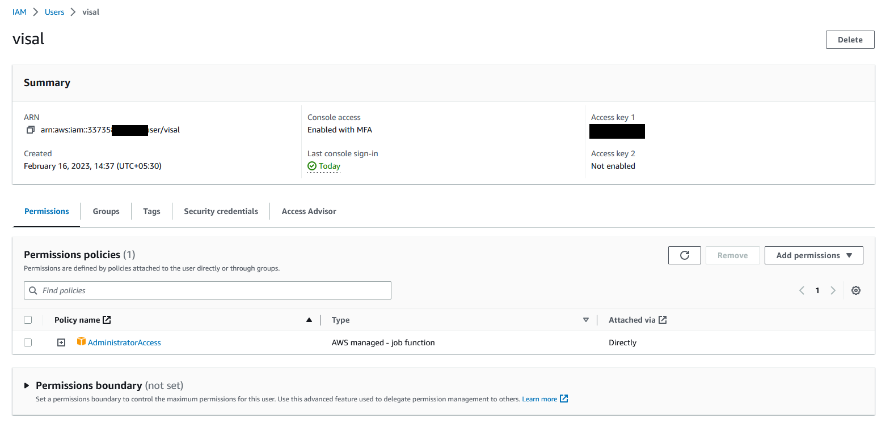
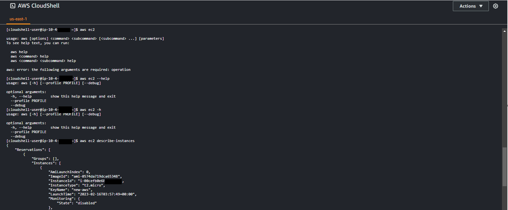

# Week 0 — Billing and Architecture

## Homework Tasks

- [x] Setting up a billing alarm, budget and Configure AWS CLI
- [x] Recreate Conceptual Diagram in Lucid Charts or on a Napkin.
- [x] Recreate Logical Architectural Diagram in Lucid Charts.
- [x] Create an Admin User
- [x] Use Cloud shell 
 
## Setting up a billing alarm, budget and Configure AWS CLI

According to instruction i created gitpod workspace. it is easy if you can install gitpod extension in your web browser so git pod button will appear in your repository so you can easily created gitpod workspace by clicking that button.  Using the [gitpod.yaml](https://github.com/Visal9/aws-bootcamp-cruddur-2023/blob/main/.gitpod.yml) script  found in the student help repository I was able to create a script that would install the AWS CLI on start.



 I stored my aws key and access key as env variables,  every time   launch new workspace gitpod will use these env variables. we can create env variable like below so it will persist in gitpod.
 ```
 gp env AWS_ACCESS_KEY_ID=#######
 gp env AWS_SECRET_KEY_ID=#######
 gp env AWS_DEFAULT_REGION=######
 ```
 

I created my budget and billing alarm using Aws cli. I will list each file I used to create these alarm in below

- Create a Budget Alarm linked to the SNS topic that will trigger when my budget has reached 80%. [budget.json](https://github.com/Visal9/aws-bootcamp-cruddur-2023/blob/main/aws/json/budget.json)

- Create a budget with notifications via SNS. [budget-notifications-with-subscribers.json](https://github.com/Visal9/aws-bootcamp-cruddur-2023/blob/main/aws/json/budget-notifications-with-subscribers.json)

- Create a CloudWatch Alarm that will trigger when a spending threshold has been met. [alarm-config.json](https://github.com/Visal9/aws-bootcamp-cruddur-2023/blob/main/aws/json/alarm-config.json)

## Create Logical and Conceptual Diagrams

- Create conceptual diagram to communicate the architecture to key stakeholders [Lucid chart diagram link](https://lucid.app/lucidchart/07b99959-d9e4-4ed9-8677-6b910e4138cd/edit?invitationId=inv_d5382893-44ef-4ac2-9a79-854a361a9359)



- Create Logical diagram to communicate the architecture to key stakeholders [Lucid chart diagram link](https://lucid.app/lucidchart/07b99959-d9e4-4ed9-8677-6b910e4138cd/edit?viewport_loc=-470%2C124%2C2167%2C945%2C0_0&invitationId=inv_d5382893-44ef-4ac2-9a79-854a361a9359)




##  Create an Admin User
Use Root user for doing work load is not recommended we should not use our root user to do our work load for that we must create user with `Administrator` access. I enable MFA so it will add additional security layer.



##  Use Cloud shell 
I used cloud shell to list all my instances
