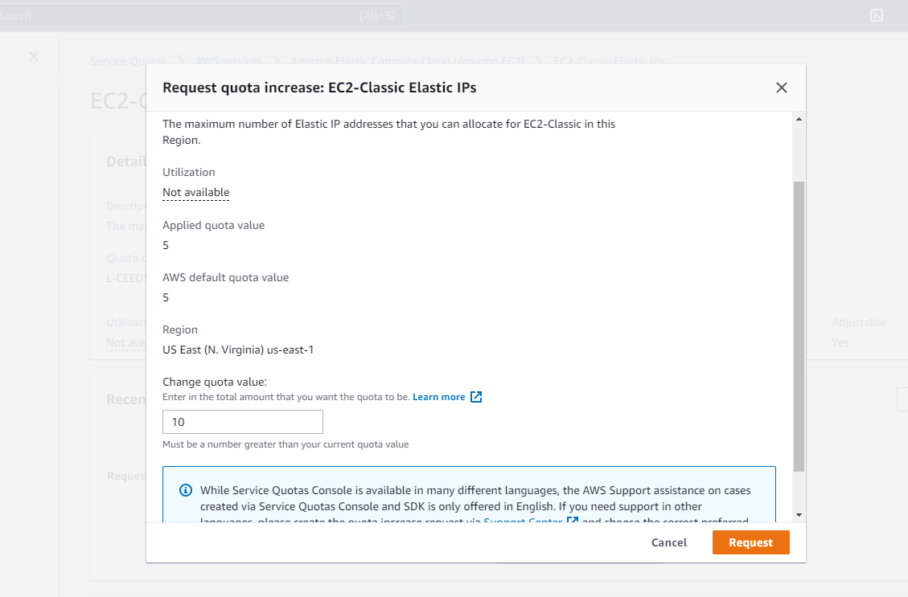

# Week 0 — Billing and Architecture

## Homework Tasks

- [x] Setting up a billing alarm, budget and Configure AWS CLI
- [x] Recreate Conceptual Diagram in Lucid Charts or on a Napkin.
- [x] Recreate Logical Architectural Diagram in Lucid Charts.
- [x] Create an Admin User
- [x] Use Cloud shell 
 
## Setting up a billing alarm, budget and Configure AWS CLI

According to instruction I created gitpod workspace. it is easy if you can install gitpod extension in your web browser so git pod button will appear in your repository so you can easily created gitpod workspace by clicking that button.  Using the [gitpod.yaml](https://github.com/Visal9/aws-bootcamp-cruddur-2023/blob/main/.gitpod.yml) script  found in the student help repository I was able to create a script that would install the AWS CLI on start.


 I stored my Aws key and access key as env variables,  every time   launch new workspace gitpod will use these env variables. we can create env variable like below so it will persist in gitpod.

 ```
 gp env AWS_ACCESS_KEY_ID=#######
 gp env AWS_SECRET_KEY_ID=#######
 gp env AWS_DEFAULT_REGION=######
 ```
 

I created my budget and billing alarm using Aws cli. I will list each file I used to create these alarm in below

- Create a Budget Alarm linked to the SNS topic that will trigger when my budget has reached 80%. [budget.json](https://github.com/Visal9/aws-bootcamp-cruddur-2023/blob/main/aws/json/budget.json)


- Create a budget with notifications via SNS. [budget-notifications-with-subscribers.json](https://github.com/Visal9/aws-bootcamp-cruddur-2023/blob/main/aws/json/budget-notifications-with-subscribers.json)


- Create a CloudWatch Alarm that will trigger when a spending threshold has been met. [alarm-config.json](https://github.com/Visal9/aws-bootcamp-cruddur-2023/blob/main/aws/json/alarm-config.json)


## Create Logical and Conceptual Diagrams

- Create conceptual diagram to communicate the architecture to key stakeholders [Lucid chart diagram link](https://lucid.app/lucidchart/07b99959-d9e4-4ed9-8677-6b910e4138cd/edit?invitationId=inv_d5382893-44ef-4ac2-9a79-854a361a9359)


- Create Logical diagram to communicate the architecture to key stakeholders [Lucid chart diagram link](https://lucid.app/lucidchart/07b99959-d9e4-4ed9-8677-6b910e4138cd/edit?viewport_loc=-470%2C124%2C2167%2C945%2C0_0&invitationId=inv_d5382893-44ef-4ac2-9a79-854a361a9359)


##  Create an Admin User
Use Root user for doing work load is not recommended we should not use our root user to do our work load for that we must create user with `Administrator` access. I enable MFA so it will add additional security layer.


##  Use Cloud shell 
I used cloud shell to list all my instances


## Homework Challenges

#### Destroy your root account credentials, Set MFA, IAM role
I used the root account only to enable billing alarms and setup my other user. I've enabled MFA on the root account and my second user account. I am using the second user account to do all the tasks.


#### Use EventBridge to hookup Health Dashboard to SNS and send notification when there is a service health issue

This was most interesting homework because I heard of event bridge but I never used it before and had no idea how to do it. but I had an idea what SNS was because I already used it in my work and it this bootcamp also we create SNS topic for billing alarm. When I do research about  this homework  found this amazing [white paper](https://docs.aws.amazon.com/health/latest/ug/cloudwatch-events-health.html) created by Aws and I followed it to do this homework


### Create an architectural diagram (to the best of your ability) the CI/CD logical pipeline in Lucid Charts

### Research the technical and service limits of specific services and how they could impact the technical path for technical flexibility.

I reviewed the Service Quotas section in AWS to see the limits for each service. An example is  Number of Elastic IPs. Here is a screenshot showing some of the limits. Note that some quotas cannot be adjusted and it is mention it under adjustable Colum as yes or no.


### Open a support ticket and request a service limit

These are steps that need to follow to increase service limit
1. Go to service quotas with in Aws [console](https://us-east-1.console.aws.amazon.com/servicequotas/home/services/ec2/quotas)
2. Click on Aws services link in top left menu
3. In search bar search for specific quota that you wish to increase(Amazon Elastic Compute Cloud in my case)
4. Select which quota you need to increate(elastic ip in my case)
5. check whether you can increase that quota in adjustable column if it says yes yo can request to increase quota
6. click request quota increase
7. Fill in your required value then click request 

