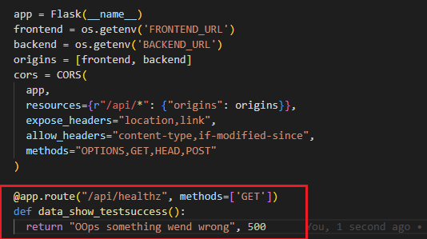

# Week 1 — App Containerization

## Installing Docker Extension in Gitpod

Install Docker extension on your Gitpod environment: mouse right click → go to “view” → go to extensions → write in search “Docker” → click “install”. Using this extension we can easily manage docker containers.

<p align="center">

</p>


## Containerizing Backend of the app
#### Write backend docker file
 In backend folder I create [Dockerfile](https://github.com/Visal9/aws-bootcamp-cruddur-2023/blob/main/backend-flask/Dockerfile) which gives instruction to docker how to create docker image for backend app:
 

 ```
 # pull in the base image
FROM python:3.12.0a5-slim

# set the working directory of the container (aka guest operating system) - make a new folder(?)
WORKDIR /backend-flask

# copy requirement file from host to container
COPY requirements.txt requirements.txt

# inside container, run installation of python libraries
RUN pip3 install -r requirements.txt

# copy files from host to container - . refers to everything in current directory to container directory
# first period - everything outside container
# second period - everything inside container
COPY . .

# set environment variables - inside the container - remain set when container is running
ENV FLASK_ENV=development

EXPOSE ${PORT}

# command to run flask
# python3 -m flask run --host=0.0.0.0 --port=4567
# 0.0.0.0 known as the 'everything address'
CMD [ "python3", "-m" , "flask", "run", "--host=0.0.0.0", "--port=4567"]

```

Before build docker image I make sure my python app run locally without any issue 

##### Now, lets try this configuration manually in our environment:

1- Go to /backend-flask

2- Run “pip3 install -r requirements.txt”


3- ```export FRONTEND_URL="*"```   ```export BACKEND_URL="*"``` we have to set these env variables otherwise backend app won't work

 4- Run App by running ```python3 -m flask run --host=0.0.0.0 --port=4567``` command


5- check port tab and see whether port 4567 is open ad make sure that is available publicly by clicking lock icon and under state in shows as ```open(public)```


6- 6- Click  the link address and add this part to end of the  URL ```/api/activities/notifications``` and refresh then we will see the following:


### Build Docker Image from Docker File

1. Make sure that you are in (/aws-bootcamp-cruddur-2023) directory
2. Run this command ```docker build -t backend-flask ./backend-flask```


3. We can see our image is built
<p align="center">

</p>

<p align="center">

</p>


### Create a container using our backend image

1. Run the following command

```FRONTEND_URL="*" BACKEND_URL="*" docker run --rm -p 4567:4567 -it backend-flask```
As you can remember when we run our app manually we set two env variables otherwise our app won't work perfectly so we have to set those env variables when we run docker container like above command

<p align="center">

</p>

<p align="center">

</p>

2. We can access our docker container logs to check everything is work fine


3. As you can see our backend is running prefect 
<p align="center">

</p>

## Containerizing Frontend app:

1. Go to frontend directory ```cd /frontend-react-js```
2. Install dependencies by running ```npm install``` command


3. Then create [Dockerfile](https://github.com/Visal9/aws-bootcamp-cruddur-2023/blob/main/frontend-react-js/Dockerfile) in frontend--react-js directory

```
FROM node:16.18

ENV PORT=3000

COPY . /frontend-react-js
WORKDIR /frontend-react-js
RUN npm install
EXPOSE ${PORT}
CMD ["npm", "start"]
```

### Building docker image for our frontend app
Run Following command to build our frontend image using docker file using Dockerfile
```docker build -t frontend-react-js ./frontend-react-js```

### Run docker Image

Run frontend app container Using the below command:
```docker run -p 3000:3000 -d frontend-react-js```

## creating docker compose file

Docker Compose is a tool for defining and running multi-container Docker applications. With Compose, you use a YAML file to configure your application’s services. Then, with a single command ```docker compose up```, you create and start all the services from your configuration.

1- Create [docker-compose.yml](https://github.com/Visal9/aws-bootcamp-cruddur-2023/blob/main/docker-compose.yaml) file in root directory

```
version: "3.8"
services:
  backend-flask:
    environment:
      FRONTEND_URL: "https://3000-${GITPOD_WORKSPACE_ID}.${GITPOD_WORKSPACE_CLUSTER_HOST}"
      BACKEND_URL: "https://4567-${GITPOD_WORKSPACE_ID}.${GITPOD_WORKSPACE_CLUSTER_HOST}"
    build: ./backend-flask
    ports:
      - "4567:4567"
    volumes:
      - ./backend-flask:/backend-flask
  frontend-react-js:
    environment:
      REACT_APP_BACKEND_URL: "https://4567-${GITPOD_WORKSPACE_ID}.${GITPOD_WORKSPACE_CLUSTER_HOST}"
    build: ./frontend-react-js
    ports:
      - "3000:3000"
    volumes:
      - ./frontend-react-js:/frontend-react-js

# the name flag is a hack to change the default prepend folder
# name when outputting the image names
networks: 
  internal-network:
    driver: bridge
    name: cruddur
```

3. Running both frontend and backend app containers using docker compose by running  ```docker-compose up``` command


4. Make sure port are private like earlier 


5. We can view the Frontend app by clicking URL in  port 3000


##  Implementing notification feature (Backend and Front)

### Implementing backend for notification feature

#### Update open API document

The reason for using open API is because we can easily import this to aws api-gateway in future , also used to test the API. The OpenAPI.yml file contains information about the API such as its endpoints, operations, parameters, and security definitions. It can also be used to generate documentation and client libraries for interacting with the API.

1. First we need to add endpoint to notification so our frontend app can access notification data using this endpoint


2. Create notification endpoint in [open API file](https://github.com/Visal9/aws-bootcamp-cruddur-2023/blob/main/backend-flask/openapi-3.0.yml)

   

#### Code explanation:
/api/activities/notifications: when we make the API usually good to scope them with /api our application will be served on API, it will be like (api.crudder.com)

description: Contain details about api endpoint

tags: This will help to  group api endpoint

responses: Indicate expected answers the server can give to this request

application/json:  Describes the structure of the content a

schema: Defines a data type of the response which can be a primitive (integer, string, …), an array or an object depending on its type field

#### updating backed code
1. In backend app we have to add route for notification feature in [app.py](https://github.com/Visal9/aws-bootcamp-cruddur-2023/blob/main/backend-flask/app.py) like below


2. Create [notification service](https://github.com/Visal9/aws-bootcamp-cruddur-2023/blob/main/backend-flask/services/notifications_activities.py) in service folder


3. Import newly created notification in  [app.py](https://github.com/Visal9/aws-bootcamp-cruddur-2023/blob/main/backend-flask/app.py) file


4. Run the app and check whether notification service will send response by accessing ```/api/activities/notification``` endpoint 


## Implement notification feature in frontend

1. First we have to create [notification page](https://github.com/Visal9/aws-bootcamp-cruddur-2023/blob/main/frontend-react-js/src/pages/NotificationsFeedPage.js)


2. Then styling notification page using [css file](https://github.com/Visal9/aws-bootcamp-cruddur-2023/blob/main/frontend-react-js/src/pages/NotificationsFeedPage.css)

3. Then import our newly created notification page in [app.js file](https://github.com/Visal9/aws-bootcamp-cruddur-2023/blob/main/frontend-react-js/src/App.js)


4. Now we are going to add a new path for notifications page in react


5. now we can view the front end app by accessing ```/notification``` path

 


## Adding DynamoDB Local and Postgres

In future we are going to use Postgres and DynamoDB  We can bring them in as containers and reference them externally. Let’s integrate the following into our existing docker compose file

1. Add DynamoDB Containers into [docker-compose file](https://github.com/Visal9/aws-bootcamp-cruddur-2023/blob/main/docker-compose.yaml)


2. Add Postgres code into [docker-compose file](https://github.com/Visal9/aws-bootcamp-cruddur-2023/blob/main/docker-compose.yaml)


3. We create docker volumes for Postgres and Dynamodb  so we won't loose data even though containers restart.
4. Lets run these containers using ```docker-compose up``` command
5. local dynamodb is a way that we can run dynamodb locally without spin up dynamodb instance in aws so we can test our app in locally. it is like a  running emulation of dynamodb 

####Test Local Dynamodb

##### Create table in Local Dynamodb

```
aws dynamodb create-table \
    --endpoint-url http://localhost:8000 \
    --table-name Music \
    --attribute-definitions \
        AttributeName=Artist,AttributeType=S \
        AttributeName=SongTitle,AttributeType=S \
    --key-schema AttributeName=Artist,KeyType=HASH AttributeName=SongTitle,KeyType=RANGE \
    --provisioned-throughput ReadCapacityUnits=1,WriteCapacityUnits=1 \
    --table-class STANDARD

```

  

##### Insert item to dynamodb

```
aws dynamodb put-item \
    --endpoint-url http://localhost:8000 \
    --table-name Music \
    --item \
        '{"Artist": {"S": "No One You Know"}, "SongTitle": {"S": "Call Me Today"}, "AlbumTitle": {"S": "Somewhat Famous"}}' \
    --return-consumed-capacity TOTAL  
    
```

#### List table in dynamodb
``` aws dynamodb list-tables --endpoint-url http://localhost:8000```


 ### Installing Postgres
 To work with postgres we have to install Driver in our env. we cand add below code int o our gitpod.yaml [file](https://github.com/Visal9/aws-bootcamp-cruddur-2023/blob/main/.gitpod.yml)

  ```
   - name: postgres
    init: |
      curl -fsSL https://www.postgresql.org/media/keys/ACCC4CF8.asc|sudo gpg --dearmor -o /etc/apt/trusted.gpg.d/postgresql.gpg
      echo "deb http://apt.postgresql.org/pub/repos/apt/ `lsb_release -cs`-pgdg main" |sudo tee  /etc/apt/sources.list.d/pgdg.list
      sudo apt update
      sudo apt install -y postgresql-client-13 libpq-dev
  ```
  After postgres Sql Extension in vscode we can add new connection
  
   Connected successfully
   

   We can connect to postgres using terminal by running following command
   
   ```psql –host localhost```


   ## Challenges

1. Run the docker CMD as an external script.

We can create a script file where dockerfile is located and copy it to image wheen buildng image
```./startup.sh /startup.sh```

Then we can run it using CMD in docker file like below 

```CMD ["/bin/bash","/startup.sh"]```

this is useful we have many commands to run while building image instead of having many run files we can create a script and run them in single RUN

2. Push and tag an image to docker hub
- Login to docker hub


- Tagging images for docker hub
  

- pushing images to docker hub
  

- Docker images push successfully to docker hub
  
   

- I created docker repo in [quay.io](https://quay.io/) so I can do image scanning in there


- tagged images for quay repo


- push images to quay repo


- Docker images push successfully to quay repo
  

  

  ### Implement a health check in the V3 Docker compos file
  I created a endpoint in backend as ```api/healthz``` so docker compose can perform health checks to that endpoint. I used [Docker Document](https://docs.docker.com/engine/reference/builder/#healthcheck) as e refence

  I intentionally send server down response to check whether health check works fine

  

Docker compose health check works successfully
  

For Frontend also I implement [docker compose](https://github.com/Visal9/aws-bootcamp-cruddur-2023/blob/main/docker-compose.yaml) health check


    
###  Research best practices of Dockerfile and attempt to implement it in your Dockerfile

