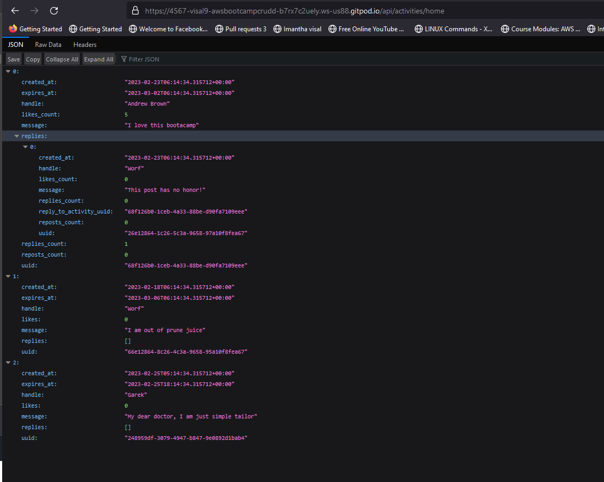
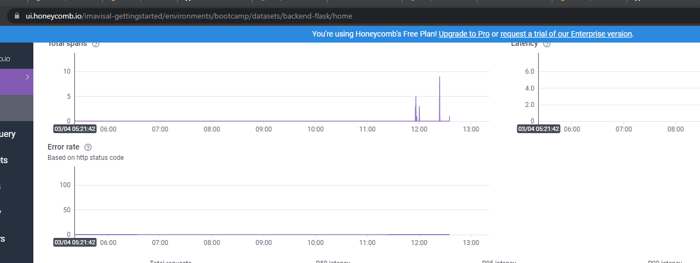

# Week 2 — Distributed Tracing
 ## 1. Instrument Honeycomb with OTEL for the Cruddur App
### create Honeycomb ENV


Create new env name ```Bootcamp```


Create new API key we use to Bootcamp env so data will land in, and we can view it and rotate it.


Now we are going to save the API in Gitpod environment:
export HONEYCOMB_API_KEY=“API-Key”
gp env HONEYCOMB_API_KEY=“API-Key”


In docker compose file we get these env variable and send it to container we didn't set service name and hardcode it in docker compose file as env variable because we need to identify which app send traces to honeycomb if we use variable name all apps will use same name and it will hard to identify which app send which traces  


To send data to honeycomb we need Open Telemetry(OTL).which manage by CNCF 
Honeycomb is not your cloud environment, the cloud environment sending standardized messages out to Honeycomb and Honeycomb will stores them in database and gives you a UI to look at them, but you could also change this configuration to send to various other open telemetry backends.

 Now let’s install OTL packages to our backend by running below command
```
pip install opentelemetry-api \
    opentelemetry-sdk \
    opentelemetry-exporter-otlp-proto-http \
    opentelemetry-instrumentation-flask \
    opentelemetry-instrumentation-requests
```


Add these packages to  [Requirement.txt](https://github.com/Visal9/aws-bootcamp-cruddur-2023/blob/main/backend-flask/requirements.txt) 

```
opentelemetry-api
opentelemetry-sdk
opentelemetry-exporter-otlp-proto-http
opentelemetry-instrumentation-flask
opentelemetry-instrumentation-requests
```
Install packages using below command:
```pip install -r requirements.txt```


#### Update [app.py](https://github.com/Visal9/aws-bootcamp-cruddur-2023/blob/main/backend-flask/app.py)

1. First Import OTL libraries
```
from opentelemetry import trace
from opentelemetry.instrumentation.flask import FlaskInstrumentor
from opentelemetry.instrumentation.requests import RequestsInstrumentor
from opentelemetry.exporter.otlp.proto.http.trace_exporter import OTLPSpanExporter
from opentelemetry.sdk.trace import TracerProvider
from opentelemetry.sdk.trace.export import BatchSpanProcessor
from opentelemetry.sdk.trace.export import ConsoleSpanExporter, SimpleSpanProcessor
```

2. Now for initialize tracing and an exporter that can send data to Honeycomb, add following:

```
provider = TracerProvider()
processor = BatchSpanProcessor(OTLPSpanExporter())
provider.add_span_processor(processor)
trace.set_tracer_provider(provider)
tracer = trace.get_tracer(__name__)

```
3. Add the below code for automatic instrumentation with Flask:
```
#Initialize automatic instrumentation with Flask
app = Flask(__name__)
FlaskInstrumentor().instrument_app(app)
RequestsInstrumentor().instrument()
```


4. Then do docker compose up

5. App is running successfully


6. We can see our backend app send data successfully



## Creating spans
 A trace is a collection of operations that represents a unique transaction handled by an application and its constituent services. A span represents a single operation within a trace we want to setup automatic instrumentation to tell us about that, so we need to add a bunch of Spans for each lets setup span in ```/api/home/activities```.

 According to  Honeycomb document we will do the following to create a span:
 
```
from opentelemetry import trace ## this are going to use the open telemetry API
tracer = trace.get_tracer("tracer.name.here")
```

Now inside def run(), we will add the rest of code:
```
with tracer.start_as_current_span("http-handler"):
```


After run our app then go to ```/api/activities/home``` page and lets send some data to honey comb. as you can see there are two span


Now we can see after  receiving request, what we did we mock the data.


Till now we used attribute automatically set by honeycomb instrumentation but we want to add our own attributes so we can investigate easily.

Now go back again to home-activites.py.
In def run() we are going to add the following:
```
span = trace.get_current_span()
 span.set_attribute("app.now", now.isoformat())
span.set_attribute("app.result_length", len(results))
```
so as below we set two attribute as ```app now```and ```app.result_length``` in [home_activities.py](https://github.com/Visal9/aws-bootcamp-cruddur-2023/blob/main/backend-flask/services/home_activities.py)


Lets check Whether honeycomb received the span with our new data. as below you can see no span has our custom attributes


We can run some queries in honeycomb in below window


As you can see our custom attribute also available for queries that the power of custom attributes.


Now let’s check the latency of this queries, by creating a new query, in Visualize add Heatmap (duration ms) also add P90 which means what is the numbers such that 90 of requests are faster that this, and run query


## 2. Instrument  AWS X-Ray for the Cruddur App

```
export AWS_REGION="us-east-1"
gp env AWS_REGION="us-east-1"
```

 Update ```requirements.txt```

```
aws-xray-sdk
```
Install pythonpendencies
```
pip install -r requirements.txt
```

Update  ```app.py``` with below code

```
from aws_xray_sdk.core import xray_recorder
from aws_xray_sdk.ext.flask.middleware import XRayMiddleware
xray_url = os.getenv("AWS_XRAY_URL")
xray_recorder.configure(service='Cruddur', dynamic_naming=xray_url)
XRayMiddleware(app, xray_recorder)
```

#### Setup AWS X-Ray Resources

Add ```aws/json/xray.json```
```
{
  "SamplingRule": {
      "RuleName": "Cruddur",
      "ResourceARN": "*",
      "Priority": 9000,
      "FixedRate": 0.1,
      "ReservoirSize": 5,
      "ServiceName": "Cruddur",
      "ServiceType": "*",
      "Host": "*",
      "HTTPMethod": "*",
      "URLPath": "*",
      "Version": 1
  }
}
```

Create new X-Ray group

```
aws xray create-group \
   --group-name "Cruddur" \
   --filter-expression "service(\"backend-flask\")"
```

X-ray group created successfully


Below you can see caws console view of x-ray group


Then created sampling rule with below command

```
aws xray create-sampling-rule --cli-input-json file://aws/json/xray.json
```


#### x-ray Daemon setup

This command implemented if we want to install it onto our environment.

```
wget https://s3.us-east-2.amazonaws.com/aws-xray-assets.us-east-2/xray-daemon/aws-xray-daemon-3.x.deb

sudo dpkg -i **.deb
```
following above command we can setup x-ray daemon in local env but in our case we will run it as a container because when we run this app on ECS we have to run it as a container so lets update our compose file with below command

```
 xray-daemon:
    image: "amazon/aws-xray-daemon"
    environment:
      AWS_ACCESS_KEY_ID: "${AWS_ACCESS_KEY_ID}"
      AWS_SECRET_ACCESS_KEY: "${AWS_SECRET_ACCESS_KEY}"
      AWS_REGION: "us-east-1"
    command:
      - "xray -o -b xray-daemon:2000"
    ports:
      - 2000:2000/udp
```

Add below env vars to compose file backend environment

```
AWS_XRAY_URL: "*4567-${GITPOD_WORKSPACE_ID}.${GITPOD_WORKSPACE_CLUSTER_HOST}*"
AWS_XRAY_DAEMON_ADDRESS: "xray-daemon:2000"
```

Lets do compose up

By viewing the x-ray logs in container, we can confirm segments successfully sent message


Go to AWS console and check the  for Traces


Evidenced that X-Ray trace appeared in AWS X-Ray console when clicked on Traces


#### create subsegment in x-ray

Lets add x-ray sub segment to user activity endpoint

add below import statement
```
from aws_xray_sdk.core import xray_recorder
```

Let's add subsegment by adding below codes
```py
    dict = {
         "now": now.isoformat(),
         "results-size": len(model['data'])
       }
       subsegment.put_metadata('key', dict, 'namespace')
       xray_recorder.end_subsegment()
```

Then close sub segment using blow code
```py
   xray_recorder.end_subsegment()
```

Lets add capture to our appp.py file by adding below command to user activity endpoint
```
@xray_recorder.capture('activities_users')
```


## 3. Instrument CloudWatch for the Cruddur App
Add to the `requirements.txt`

```
watchtower
```

```sh
pip install -r requirements.txt
```


Update `app.py` file

```
import watchtower
import logging
from time import strftime
```

```py
# Configuring Logger to Use CloudWatch
LOGGER = logging.getLogger(__name__)
LOGGER.setLevel(logging.DEBUG)
console_handler = logging.StreamHandler()
cw_handler = watchtower.CloudWatchLogHandler(log_group='cruddur')
LOGGER.addHandler(console_handler)
LOGGER.addHandler(cw_handler)
LOGGER.info("some message")
```

above code snippet will create log group named Cruddur in cloudWatch with handler

below code snippet create log error after every request
```py
@app.after_request
def after_request(response):
    timestamp = strftime('[%Y-%b-%d %H:%M]')
    LOGGER.error('%s %s %s %s %s %s', timestamp, request.remote_addr, request.method, request.scheme, request.full_path, response.status)
    return response
```

We'll log something in an API endpoint

update ```/actvitiest/home``` route in ```app.py``` like below


Add following to home activities page

```py
def run(Logger):
    logger.info("HomeActivites")
```


Set the env var in your backend-flask for `docker-compose.yml`

```yml
      AWS_DEFAULT_REGION: "${AWS_DEFAULT_REGION}"
      AWS_ACCESS_KEY_ID: "${AWS_ACCESS_KEY_ID}"
      AWS_SECRET_ACCESS_KEY: "${AWS_SECRET_ACCESS_KEY}"
```

View logs in cloud watch

CloudWatch logs group


CloudWatch Logs streams


> passing AWS_REGION doesn't seems to get picked up by boto3 so pass default region instead


## 4. Instrument CloudWatch for the Cruddur App

Update requirement.txt file with below two packages

```
blinker
rollbar
```

Lets intall requirement  by running below command
```
pip install -r requirements.txt
```

Set Rollbar access token as env variable

```
export ROLLBAR_ACCESS_TOKEN="135ec44feaxxxxxxxxxx9268aa5d7a00"
gp env ROLLBAR_ACCESS_TOKEN="135ec44feaxxxxxxxxxx9268aa5d7a00"
```

we can find Rollbar access token in this page


Lets update our app.py with Rollbar

import statements

```py
import rollbar
import rollbar.contrib.flask
from flask import got_request_exception

```

intialize rollbar using below command in ```app.py`` file

```py
rollbar_access_token = os.getenv('ROLLBAR_ACCESS_TOKEN')
@app.before_first_request
def init_rollbar():
    """init rollbar module"""
    rollbar.init(
        # access token
        rollbar_access_token,
        # environment name
        'production',
        # server root directory, makes tracebacks prettier
        root=os.path.dirname(os.path.realpath(__file__)),
        # flask already sets up logging
        allow_logging_basic_config=False)

    # send exceptions from `app` to rollbar, using flask's signal system.
    got_request_exception.connect(rollbar.contrib.flask.report_exception, app)

```

Add endpoint for Rollbar in app.py for testing
```py
@app.route('/rollbar/test')
def rollbar_test():
    rollbar.report_message('Hello World!', 'warning')
    return "Hello World!"
```

Then add  ROLLBAR_ACCESS_TOKEN env var to backend-flask service in ```docker-compose.yml```

```yml
ROLLBAR_ACCESS_TOKEN: "${ROLLBAR_ACCESS_TOKEN}"
```

lets do compose up and check Rollbar endpoint


Lets go to rollbar and check whether our log recieved or not


As you can see our log rcieved to rollbar successfully
## streached homework
### AWS XRay Traces and Segments for notification page

I added xray segment for [notification](https://github.com/Visal9/aws-bootcamp-cruddur-2023/blob/main/backend-flask/services/notifications_activities.py) page.
Here is the segment timeline and metadata for Notification service segment


#### Rollbar Test on Error
Like Andrew's telling in video  created error intentionally by removing ```return`` statement in home.activies.py
Then visit that page to generate error so we can confirm rollbar work fine
got an error in browser window 
As you can see in below error was recorded in Rollbar


HoneyComb Save Queries
saved the query created during the class: Heatmap saved [query](./images/honey-query-example.png)