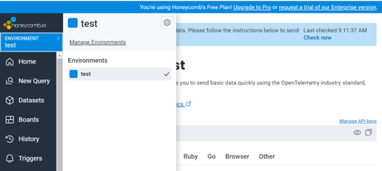
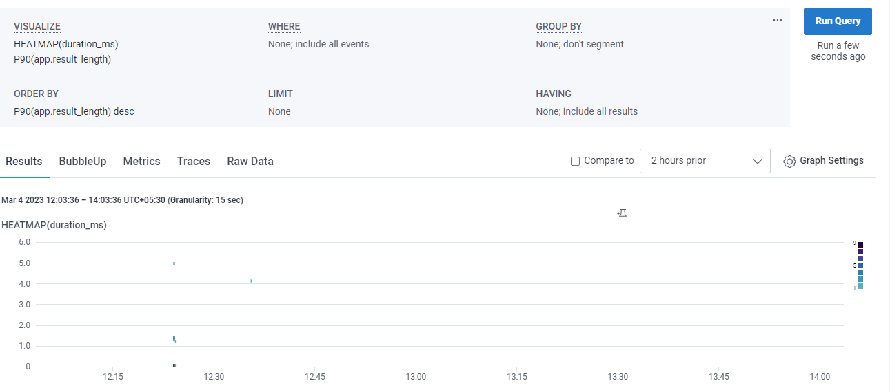

# Week 2 — Distributed Tracing

### create Honeycomb ENV


Create new env name ```Bootcamp```


Create new API key we use to Bootcamp env so data will land in, and we can view it and rotate it.


Now we are going to save the API in Gitpod environment:
export HONEYCOMB_API_KEY=“API-Key”
gp env HONEYCOMB_API_KEY=“API-Key”


In docker compose file we get these env variable and send it to container we didn't set service name and hardcode it in docker compose file as env variable because we need to identify which app send traces to honeycomb if we use variable name all apps will use same name and it will hard to identify which app send which traces  


To send data to honeycomb we need Open Telemetry(OTL).which manage by CNCF 
Honeycomb is not your cloud environment, the cloud environment sending standardized messages out to Honeycomb and Honeycomb will stores them in database and gives you a UI to look at them, but you could also change this configuration to send to various other open telemetry backends.

 Now let’s install OTL packages to our backend by running below command
```
pip install opentelemetry-api \
    opentelemetry-sdk \
    opentelemetry-exporter-otlp-proto-http \
    opentelemetry-instrumentation-flask \
    opentelemetry-instrumentation-requests
```


Add these packages to  [Requirement.txt](https://github.com/Visal9/aws-bootcamp-cruddur-2023/blob/main/backend-flask/requirements.txt) 

```
opentelemetry-api
opentelemetry-sdk
opentelemetry-exporter-otlp-proto-http
opentelemetry-instrumentation-flask
opentelemetry-instrumentation-requests
```
Install packages using below command:
```pip install -r requirements.txt```


#### Update [app.py](https://github.com/Visal9/aws-bootcamp-cruddur-2023/blob/main/backend-flask/app.py)

1. First Import OTl libraries
```
from opentelemetry import trace
from opentelemetry.instrumentation.flask import FlaskInstrumentor
from opentelemetry.instrumentation.requests import RequestsInstrumentor
from opentelemetry.exporter.otlp.proto.http.trace_exporter import OTLPSpanExporter
from opentelemetry.sdk.trace import TracerProvider
from opentelemetry.sdk.trace.export import BatchSpanProcessor
from opentelemetry.sdk.trace.export import ConsoleSpanExporter, SimpleSpanProcessor
```

2. Now for initialize tracing and an exporter that can send data to Honeycomb, add following:

```
provider = TracerProvider()
processor = BatchSpanProcessor(OTLPSpanExporter())
provider.add_span_processor(processor)
trace.set_tracer_provider(provider)
tracer = trace.get_tracer(__name__)

```
3. Add the below code for automatic instrumentation with Flask:
```
#Initialize automatic instrumentation with Flask
app = Flask(__name__)
FlaskInstrumentor().instrument_app(app)
RequestsInstrumentor().instrument()
```

4. Then do docker compose up

5. App is running successfully


6. We can see our backend app send data successfully


## Creating spans
 A trace is a collection of operations that represents a unique transaction handled by an application and its constituent services. A span represents a single operation within a trace we want to setup automatic instrumentation to tell us about that, so we need to add a bunch of Spans for each lets setup span in ```/api/home/activities```.

 According to  Honeycomb document page we will do the following to create a span:
 
```
from opentelemetry import trace ## this are going to use the open telemetry API
tracer = trace.get_tracer("tracer.name.here")
```

Now inside def run(), we will add the rest of code:
```
with tracer.start_as_current_span("http-handler"):
```
After run our app then go to ```/api/activities/home``` page and lets send some data to honey comb. as you can see there are two span


Now we can see after  receiving request, what we did we mock the data.


Till now we used attribute automatically set by honeycomb instrumentation but we want to add our own attributes so we can investigate easily.

Now go back again to home-activites.py.
In def run() we are going to add the following:
```
span = trace.get_current_span()
 span.set_attribute("app.now", now.isoformat())
span.set_attribute("app.result_length", len(results))
```
so as below we set two attribute as ```app now```and ```app.result_length``` in [home_activities.py](https://github.com/Visal9/aws-bootcamp-cruddur-2023/blob/main/backend-flask/services/home_activities.py)


Lets check Whether honeycomb received the span with our new data. as below you can see no span has our custom attributes


We can run some queries in honeycomb in below window


As you can see our custom attribute also available for queries that the power of custom attributes.


Now let’s check the latency of this queries, by creating a new query, in Visualize add Heatmap (duration ms) also add P90 which means what is the numbers such that 90 of requests are faster that this, and run query
